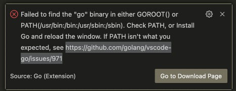

# flapak-vscode-as-go-ide

This repo describe a possible installation of go (golang) useful to interact with it using vscode installed from flatpak

# the problem

If you have installed the vscode [Visual Studio Code](https://code.visualstudio.com/) using flatpak, after the `go` 
installation you probably meet this error:



and whatever 'environment set' (GOROOT in this case) you try to do, the error persist!

The problem is generated by the "different installation context". Because the `flatpak apps` runs "inside a sandbox" with
a dedicated context. In fact if you read (like above) the error, you can see a "strange PATH", like: `PATH(/app/bin:/app/local/bin ...)`
and `GOROOT()` despite your local machine has a different `$PATH` env and a well-defined `$GOROOT` env.

# the idea

The idea has been to set some environment variables to flatpak configuration with an injected shared context! You can do this
configuring the file:

```Shell
/var/lib/flatpak/overrides
```

adding (or modifying) this sections:

```Shell
[Context]
filesystems=<your-shared-context-path>

[Environment]
GOROOT=<the-goroot-path>
```

but... there was one more problem! Because the "default" path installation proposed by [Google](https://go.dev/doc/install)
is `/usr/local/go` and this path is a private path in flatpak sandbox! and then if you use as `GOROOT` path the
Google proposed path (`/usr/local/go`) like this:

```Shell
[Context]
filesystems=/usr/local/go

[Environment]
GOROOT=/usr/local/go/bin
```
flatpak return an error like this: `/usr` <span style="color:red">is a private path</span>.

# the solution

The solution is to install `go` to no private path (flatpak side), and overrides a default flatpak configuration like above.

## the steps

- remove aol go installation
- download tar archive from the `go` site
- unpack the tar archive to custom (no private) directory
- edit $HOME/.bashrc (adding/editing the environment vars)
- reload the $HOME/.bashrc
- check `go` command (eg: `go env`)
- edit the file `/var/lib/flatpak/overrides/global` (or run the flatpak command)

you can find the beloved steps inside the `script.sh`. You can run as-is or c&p approach.

**NOTE**: my preferred installation path is `$HOME/.golang` (`that is != $HOME/go`)

# the result

After to complete this configuration, you can see the `go` compiler message under the 'PROBLEM' tab

